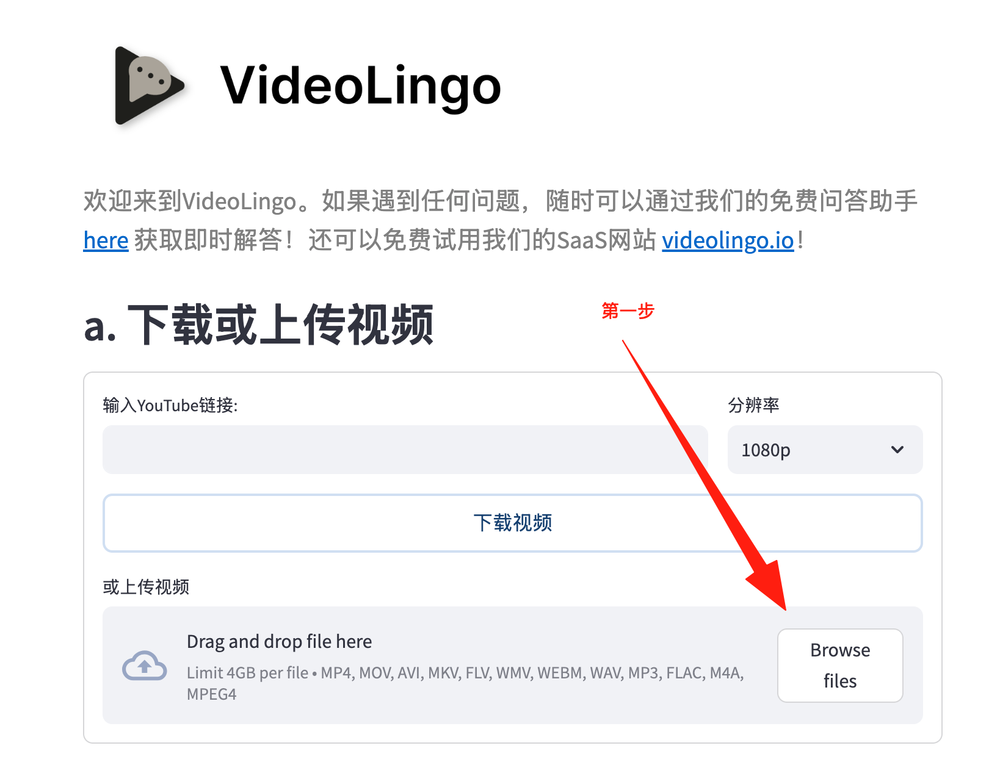
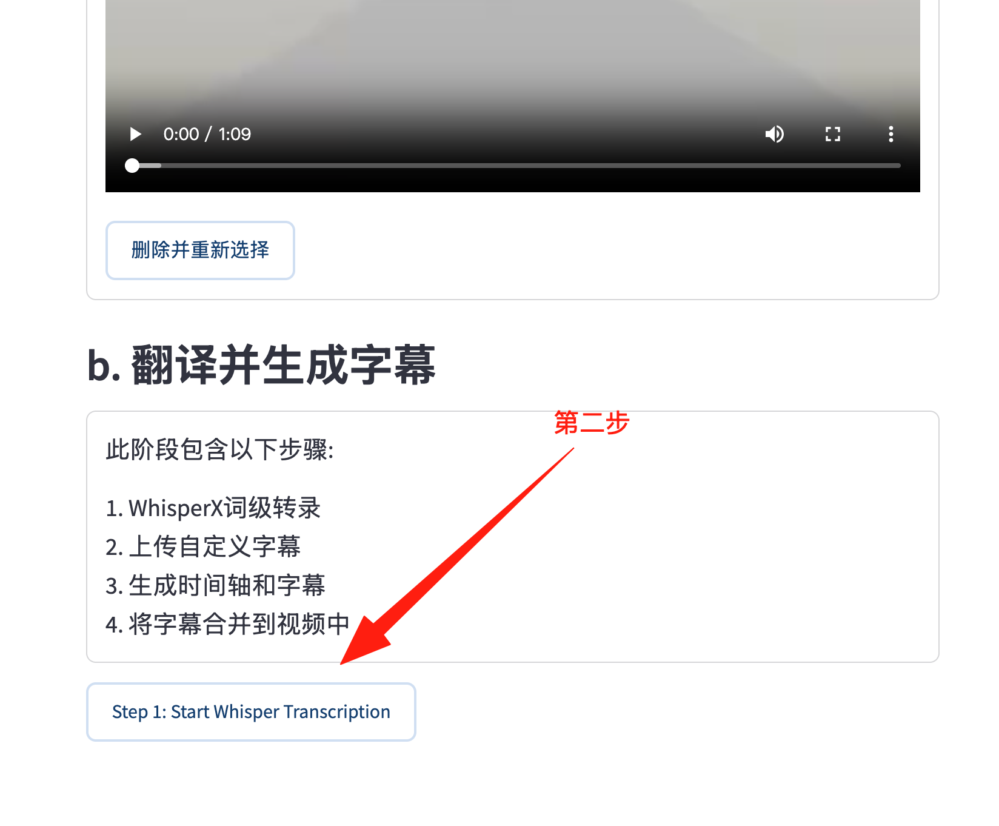
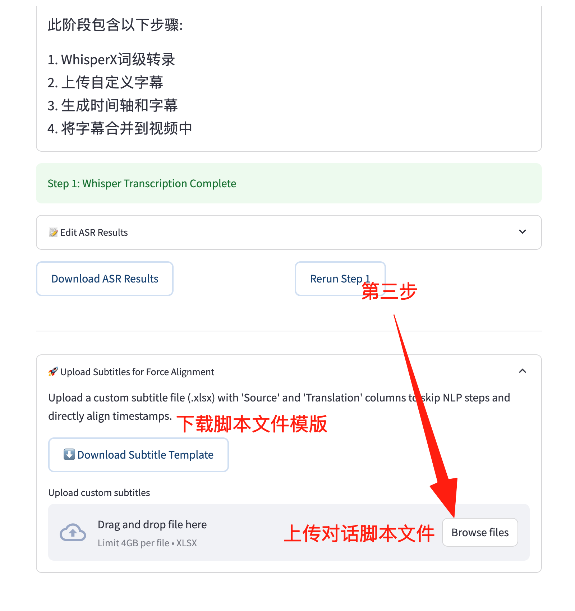
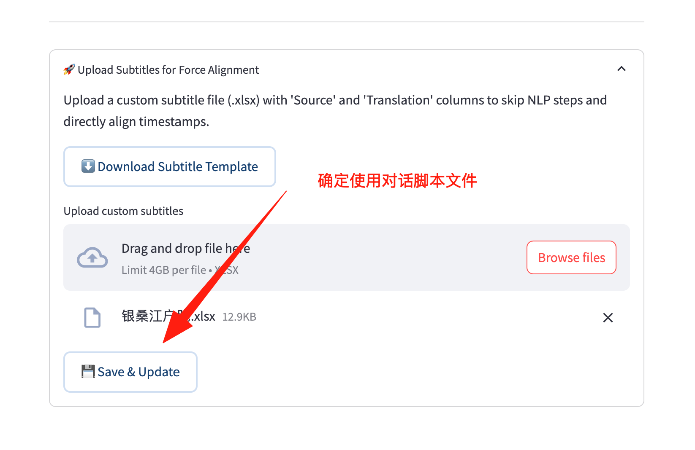
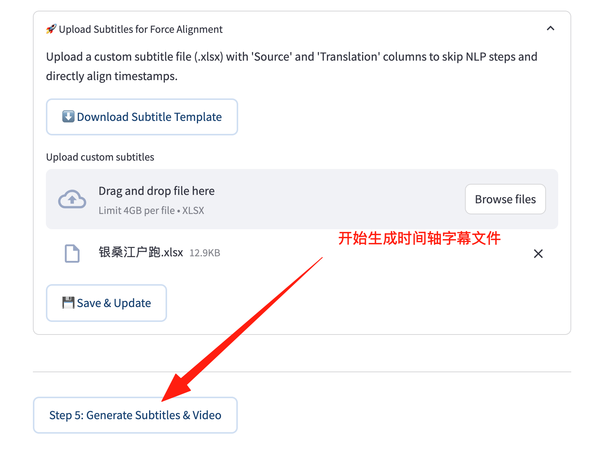
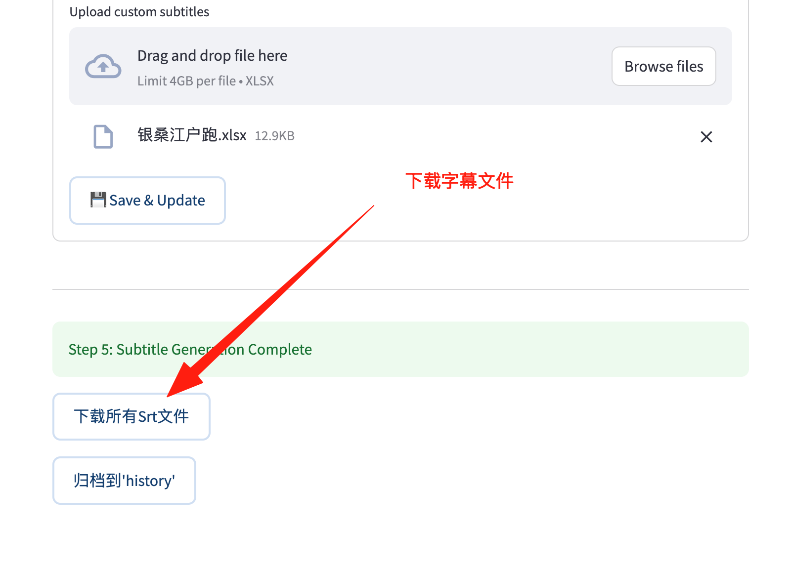
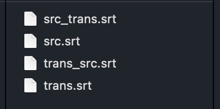

# 📖 VideoLingo 使用手册

欢迎使用 VideoLingo！本文档将指导您完成从视频下载到生成最终多语种配音视频的全过程。

## 1. 操作说明

### 第一步：上传视频

- 点击 **"Browse files"** 上传本地视频文件（支持 mp4, mov, avi 等格式）。
- 系统会自动将上传的文件保存并准备处理。

### 第二步：Whisper 转写 (Step 1: Transcription)

视频准备好后，点击 **"Step 1: Start Whisper Transcription"** 按钮。

- 系统将使用 Whisper 模型对视频进行语音识别和转写。
- **注意**: 这一步可能需要一些时间，具体取决于视频长度和硬件性能。

转写完成后，您将看到 "Step 1: Whisper Transcription Complete" 的提示。

### 第三步：对话脚本 excel 文件上传

- **准备 Excel 文件**: 您需要一个包含 `Source` (原文) 和 `Translation` (译文) 列的 `.xlsx` 文件。
  - 您可以点击 **"⬇️ Download Subtitle Template"** 下载模版。
- **上传**: 将编辑好或翻译好的 Excel 文件上传。
- 点击 **"💾 Save & Update"**。
- 系统将验证文件格式并准备进行强制对齐（Force Alignment）。

> **提示**: 这一步允许您完全控制翻译质量，您可以上传人工精校的字幕文件，系统将利用 Whisper 的时间轴信息进行完美对齐。

### 第四步：确定保存字幕脚本

### 第五步：生成最终视频 (Step 5: Generate)

当翻译文件准备就绪后，界面将显示 **"Step 5: Generate Subtitles & Video"** 按钮

- **下载结果**:
  - 点击 **"Download All Srt Files"** 下载生成的字幕文件包。

## 4. 常见问题

- **如何重新开始？**
  - 点击 "Delete and Reselect" 删除当前视频并重置状态。
  - 点击 "Rerun Step 1" 仅重新运行转写步骤（将删除后续所有进度）。
  - 点击 "Archive to 'history'" 将当前结果归档并开始新任务。
- **报错处理**:
  - 如果遇到 API 错误，请检查侧边栏的 Key 是否正确。
  - 如果字幕对齐不准，请检查上传的 Excel 文件中原文是否与视频语音大体对应。

---

_文档更新日期: 2026-01-20_
